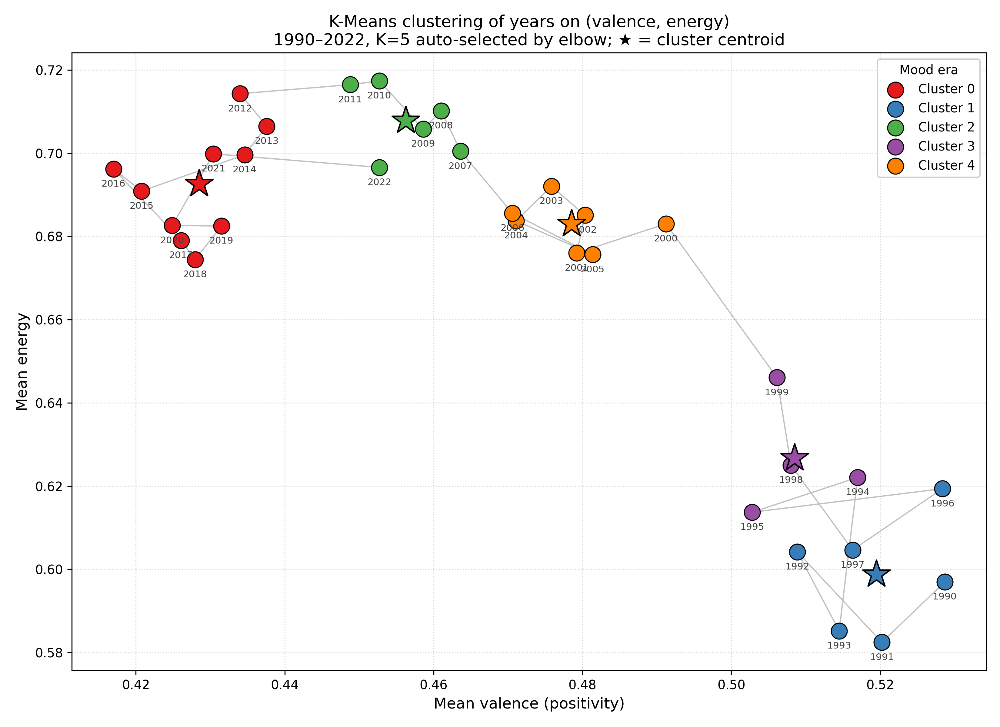
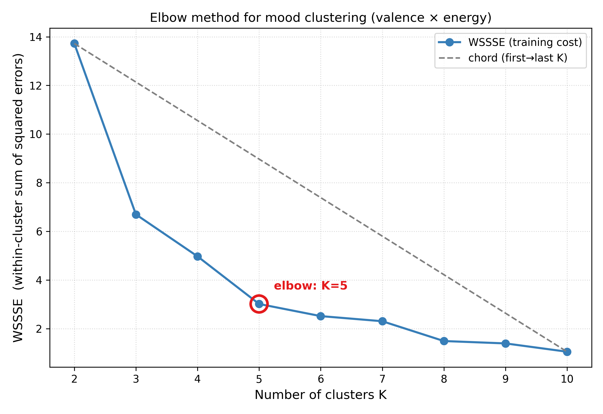
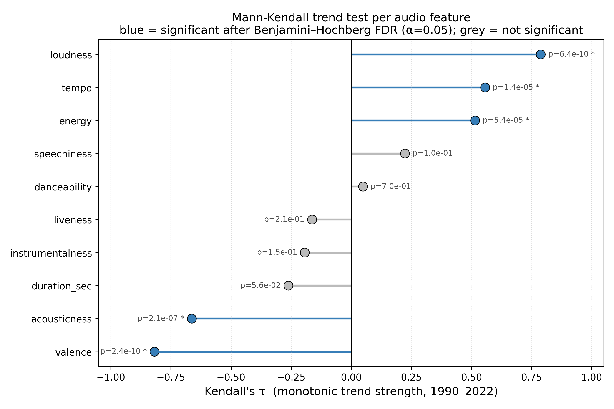
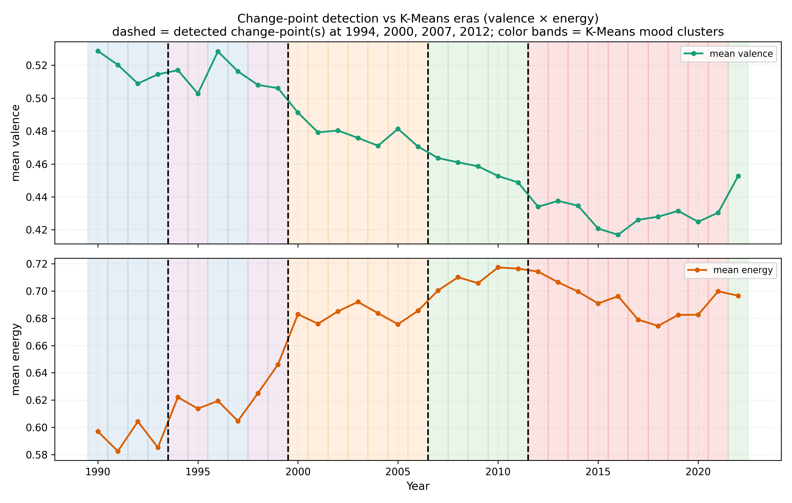
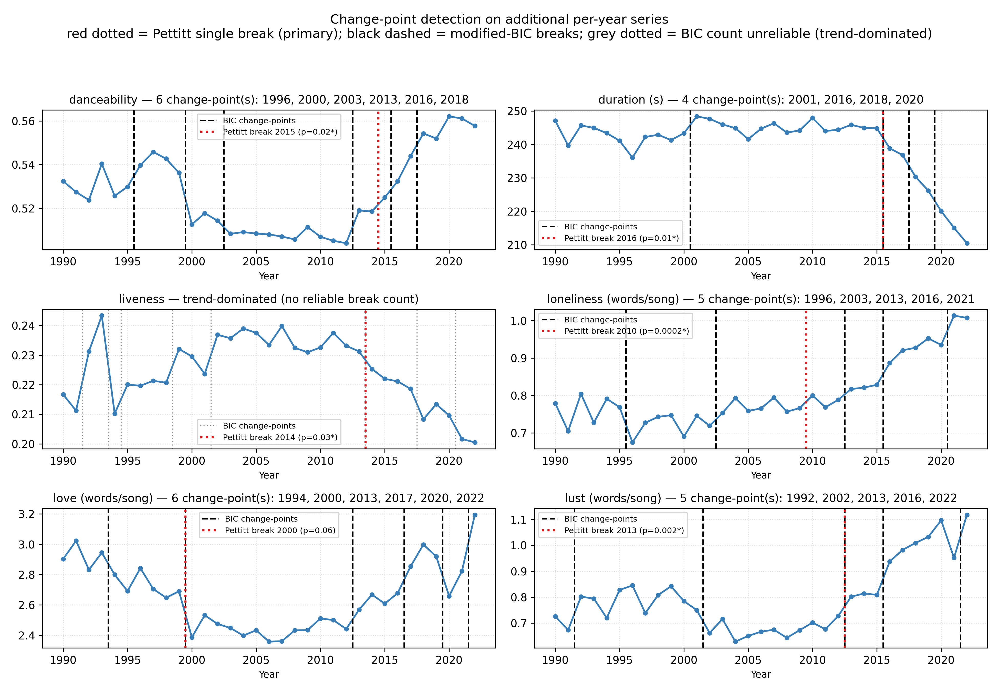
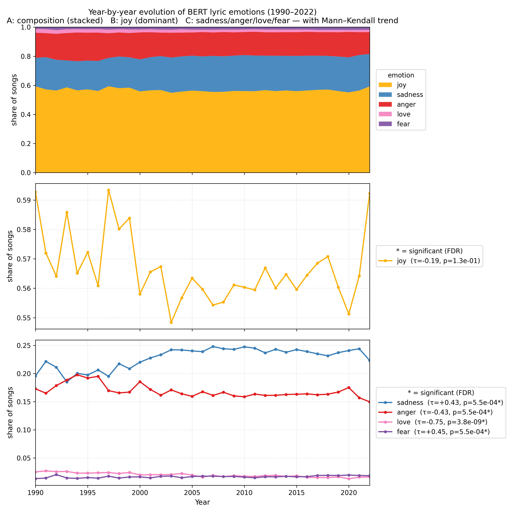

# How Love Flies 🎵

**A large-scale analysis of how the sound and sentiment of music evolved from 1990 to 2022.**

*How Love Flies* is an Apache Spark + Scala data pipeline that ingests a corpus of
Spotify tracks and answers a simple question with big-data tooling: **how has music
changed over three decades: both in how it *sounds* and in how it *reads*?**

It combines two complementary views of every song:

- **Audio features** (danceability, energy, valence, tempo, loudness, …) drawn from
  Spotify's track metadata.
- **Lyrical emotion**, inferred chunk-by-chunk with a fine-tuned BERT sequence
  classifier from [Spark NLP](https://sparknlp.org/), then aggregated up to a single
  dominant emotion per song.

On top of these, the project clusters individual years by their *mood* and by their
*genre mix* to surface eras and turning points in popular music.

---

## Table of contents

- [Highlights](#highlights)
- [Results](#results)
- [How it works](#how-it-works)
- [Project structure](#project-structure)
- [Getting started](#getting-started)
- [Outputs](#outputs)
- [Tech stack](#tech-stack)

---

## Highlights

- **End-to-end Spark pipeline** — load → clean → analyze → cluster → write, all on a
  single ~850 MB songs dataset processed locally with `local[*]`.
- **Transformer-based emotion analysis** — a `bert_sequence_classifier_emotion` model
  labels each lyric chunk as *joy, sadness, anger, love,* or *fear*; per-song results
  are obtained by majority vote across chunks.
- **Resumable, checkpointed inference** — BERT runs year-by-year and writes a
  `_SUCCESS`-marked partition per year, so a long inference job can be stopped and
  restarted without redoing finished years.
- **Unsupervised era detection** — K-Means clusters the 33 years (1990–2022) on
  `(valence, energy)` and on genre mix, with **K auto-selected** by a Kneedle-style
  elbow heuristic over WSSSE.
- **Self-rendered visualizations** — scatter and timeline charts are drawn directly
  with Java2D (`BufferedImage`), no external plotting service required.

## Results

### Mood of the years — valence × energy clusters
Each point is a single year, positioned by its mean valence and mean energy, then
grouped by K-Means into mood clusters.



### Picking K — mood elbow
WSSSE vs K for the mood clustering, with the auto-selected elbow.



### Audio-feature trends
Mann–Kendall trend tests across all audio features over 1990–2022.



### Change points
Detected break years in the `(valence, energy)` mood signal.



### Per-feature change points
Change points detected within individual audio features.



### Lyric emotion trends
Share of songs by dominant BERT-classified emotion over time.



Tabular results for every analysis live under [`csvFiles/`](csvFiles/) (Spark outputs)
and [`report_figures/`](report_figures/) (Python post-analysis + the figures above);
see [Outputs](#outputs).

## How it works

The whole job is orchestrated by
[`Main.scala`](src/main/scala/com/yurekce/sparkproject/Main.scala):

1. **Load & clean** — [`DataLoader`](src/main/scala/com/yurekce/sparkproject/DataLoader.scala)
   reads `spotify_data/songs.csv`;
   [`Filter`](src/main/scala/com/yurekce/sparkproject/Filter.scala) keeps the
   1990–2022 window and drops rows with missing valence, lyrics, genre, etc. The
   cleaned frame is cached with `MEMORY_AND_DISK`.

2. **Per-feature trends** — a family of small analyzers
   (`DanceabilityAnalyzer`, `EnergyAnalyzer`, `ValenceAnalyzer`, `TempoAnalyzer`,
   `LoudnessAnalyzer`, `AcousticnessAnalyzer`, …) each compute a feature's yearly
   average and write a tab-separated CSV.

3. **Year clustering** —
   [`YearMoodClusterer`](src/main/scala/com/yurekce/sparkproject/YearMoodClusterer.scala)
   and
   [`YearGenreClusterer`](src/main/scala/com/yurekce/sparkproject/YearGenreClusterer.scala)
   vectorize + standardize each year, run K-Means for K = 2…10, pick the elbow, and
   render a chart.

4. **Lyric emotion (BERT)** —
   [`LyricsCleaner`](src/main/scala/com/yurekce/sparkproject/LyricsCleaner.scala)
   splits each song's lyrics into 8-line chunks;
   [`EmotionProcessing`](src/main/scala/com/yurekce/sparkproject/EmotionProcessing.scala)
   fits the BERT pipeline once and classifies de-duplicated chunks. Results are
   aggregated into per-emotion counts per song and reduced to a single
   `song_emotion`.

5. **Persist** — final per-song emotions are written to `checkpoints/finalResult/`.

> The repository also contains lexical analyzers
> ([`LoveAndLustAnalyzer`](src/main/scala/com/yurekce/sparkproject/LoveAndLustAnalyzer.scala),
> [`LonelinessAnalyzer`](src/main/scala/com/yurekce/sparkproject/LonelinessAnalyzer.scala))
> and an approximate-nearest-neighbour song recommender
> ([`RecommenderANN`](src/main/scala/com/yurekce/sparkproject/RecommenderANN.scala))
> built on LSH. These paths are toggled off in `Main` for the full BERT run but can
> be re-enabled.

## Project structure

```
How-Love-Flies/
├── build.sbt                     # Spark / Spark-NLP dependencies, JVM heap settings
├── project/build.properties      # sbt version
├── src/main/scala/com/yurekce/sparkproject/
│   ├── Main.scala                # pipeline orchestration
│   ├── config/SparkConfig.scala  # SparkSession (cores, memory, Kryo)
│   ├── DataLoader.scala          # CSV ingestion
│   ├── Filter.scala              # cleaning / windowing
│   ├── LyricsCleaner.scala       # lyric → chunk splitting
│   ├── EmotionProcessing.scala   # BERT emotion pipeline + aggregation
│   ├── *Analyzer.scala           # per-feature yearly trends
│   └── Year*Clusterer.scala      # K-Means era detection + charts
├── csvFiles/                     # committed analysis results + charts
├── report_figures/               # Python post-analysis (trend/change-point tests) + paper figures
└── latex/                        # write-up (how_love_flies.tex / .pdf)
```

> Generated artifacts — the 850 MB input under `spotify_data/`, `checkpoints/`,
> `target/`, `spark-warehouse/`, and IDE folders — are intentionally **not** tracked
> (see [`.gitignore`](.gitignore)). Only source code and the small, human-readable
> result set are committed.

## Getting started

### Prerequisites

- **JDK 8 or 11** (Spark 3.5 requirement)
- **sbt** 1.12+
- ~12 GB of RAM available to the JVM (the BERT model + Spark broadcast are memory
  hungry; heap is set to `-Xmx12g` in [`build.sbt`](build.sbt))
- **A CUDA-capable NVIDIA GPU** — the Spark session pulls the GPU build of Spark NLP
  (`spark-nlp-gpu_2.12`, see
  [`SparkConfig.scala`](src/main/scala/com/yurekce/sparkproject/config/SparkConfig.scala)),
  which requires a working CUDA runtime to run the BERT emotion classifier. To run on
  CPU instead, swap that dependency for the plain `spark-nlp` artifact.

### Data

The pipeline expects a Spotify songs export at `spotify_data/songs.csv` with at least
the columns used by the analyzers (`id`, `year`, `genre`, `niche_genres`, `lyrics`,
`valence`, `energy`, `danceability`, `tempo`, `loudness`, `popularity`, …). This file
is large and not redistributed here.

### Run

```bash
sbt "runMain com.yurekce.sparkproject.Main"
```

The job forks a fresh JVM (configured in `build.sbt`) so Spark's driver gets the full
heap. Spark NLP downloads the pretrained emotion model on first run.

## Outputs

| Path | Contents |
|------|----------|
| `csvFiles/<feature>Data/` | Yearly average for each audio feature |
| `csvFiles/clustering/year_mood/` | Elbow scores, chosen K, year→cluster, scatter chart |
| `csvFiles/clustering/year_genre/` | Same, for genre-mix clustering + timeline chart |
| `csvFiles/comparisons/` | Cross-cuts such as tempo by genre |
| `csvFiles/songCountByYear/` | Corpus size per year |
| `checkpoints/emotionPerChunk/year=YYYY/` | *(generated)* per-year BERT output |
| `checkpoints/finalResult/` | *(generated)* dominant emotion per song |

CSV result files are tab-separated and include a header row.

## Tech stack

- **Scala** 2.12.18
- **Apache Spark** 3.5.8 — Core, SQL, MLlib (K-Means, VectorAssembler, StandardScaler)
- **Spark NLP** 6.3.3 — `bert_sequence_classifier_emotion`
- **Java2D** — chart rendering
- **sbt** — build

---

*An academic term project exploring big-data processing, distributed ML, and NLP on
three decades of music.*

## License

All rights reserved. This repository is public for reference and educational
viewing only; reuse, redistribution, or modification is not permitted without
written consent. See [`LICENSE`](LICENSE).
